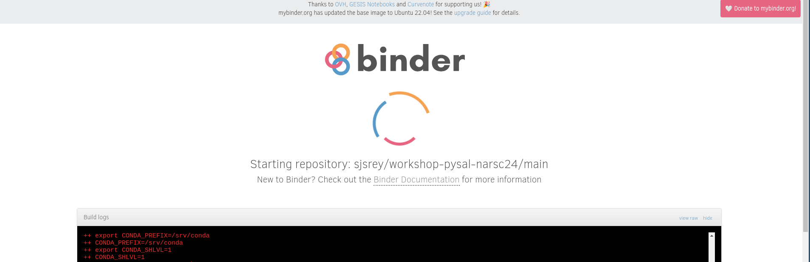
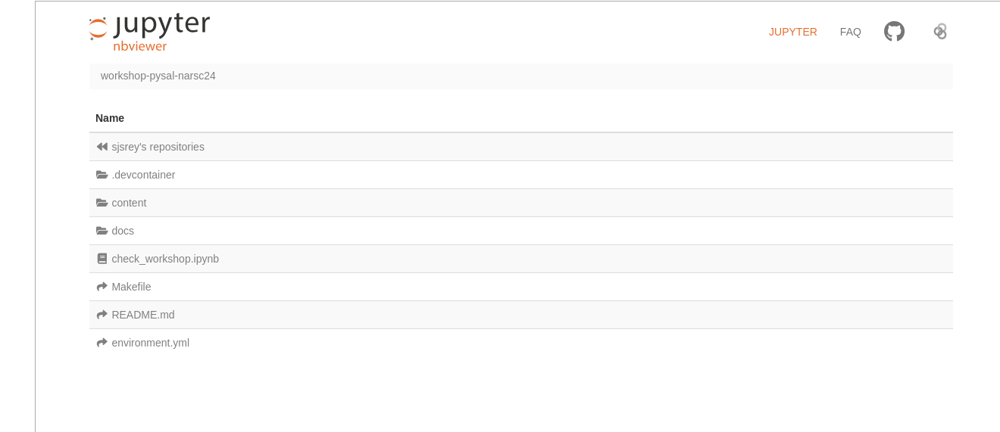
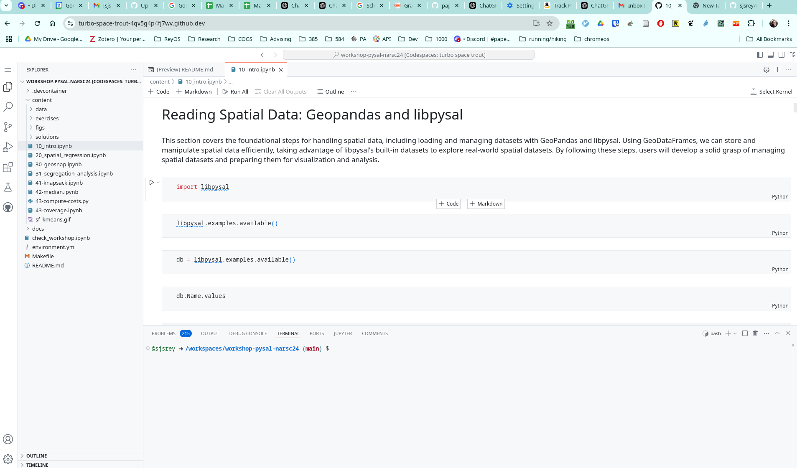

# workshop-pysal-narsc24

[](https://codespaces.new/sjsrey/workshop-pysal-narsc24)

[](https://mybinder.org/v2/gh/sjsrey/workshop-pysal-narsc24/main?urlpath=lab)

Spatial Analysis and Econometrics with PySAL

<p align="center">

</p>

### Instructors

* Pedro Amaral - Universidade Federal de Minas Gerais
* Luc Anselin - University of Chicago
* Eli Knaap - San Diego State University
* Serge Rey - San Diego State University
* Levi Wolf - University of Bristol

---

## Schedule

* 8:00-9:50 1. Spatial Data Analysis
  
  * Introduction
  * Geoprocessing
  * Visualization
  * Spatial Weights
  * Spatial Autocorrelation

* 9:50-10:10 Break

* 10:10-12:00 2. Spatial Econometrics

  * Basic Data Management
  * OLS with Spatial Diagnostics
  * Specification Search
  * The SLX model
  * Spatial Lag and Spatial Durbin Models 
  * Spatial Impacts
  
* 12:00-1:00 Lunch

* 1:00-2:50 3. Segregation and Geodemographics

  * GeoSNAP
  * Geodemographics
  * Segregation
  
  
* 2:50-3:10 Break

* 3:10-5:00 4. Spatial Optimzation

  * Mixed Integer Linear Programming
  * P-median Problem
  * Coverage Problems


## Getting Set Up

There are three options for working with the content of the workshop:

1. Binder (no-installation, ephemeral)
2. Codespace (no-installation, stateful)
3. Local installation 


### Binder
This option relies on resources that run in the cloud. A virtual machine will be built for you. This should take 10-15 minutes to build.
Once it is built, you can run the notebooks via a browser.

The key thing to keep in mind with this option is that it is emphemeral. Once you should down, or disconnect, your work will be gone (unless you save your notebooks via downloading as you are working in binder).

__To get started immediately without installing or downloading anything, click [](https://mybinder.org/v2/gh/sjsrey/workshop-pysal-narsc24/main?urlpath=lab)__

You will see binder starting up:



Once the virtual machine is up you will see:



and you are ready to go.


### Codespaces

If you would like to use remote resources, but have your work saved, then the Codespaces option is what you want.
For this you need to have a github account XXX.

Once you have your github account you can create the codespace:

[](https://codespaces.new/sjsrey/workshop-pysal-narsc24)

When the codespace is built, your browser should look something like:



### Local Installation

If you are familiar with GitHub, you should clone or fork this GitHub repository to a specific directory. Cloning can be done by:

```bash
git clone https://github.com/sjsrey/workshop-pysal-narsc24.git
```

If you are not using git, you can grab the workshop materials as a zip file by pointing your browser to (<https://github.com/sjsrey/workshop-pysal-narsc24.git>) and clicking on the green _Clone or download_ button in the upper right. Extract the downloaded zip file to a working directory.

See the [installation instructions](docs/installation.md) for more information on getting a python environment setup
